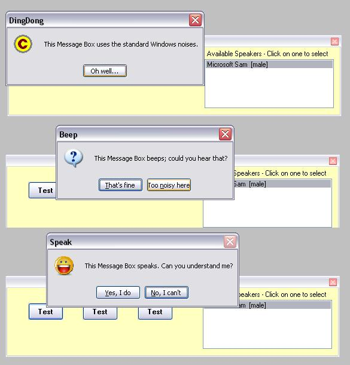



## Extended Message Box

### Description

This is a standard message box; however it gives you total control over all its features from icon displayed via button captions and sound to positioning and auto-timeout. It can even speak, if you want it to! A little testdriver is included to show how it all goes.
 
### More Info
 
Standard MsgBox return values

             |
---                |---
**Submitted On**   |2007-01-21 16:40:46
**By**             |[ULLI](https://github.com/Planet-Source-Code/PSCIndex/blob/master/ByAuthor/ulli.md)
**Level**          |Intermediate
**User Rating**    |4.9 (39 globes from 8 users)
**Compatibility**  |VB 6\.0
**Category**       |[Libraries](https://github.com/Planet-Source-Code/PSCIndex/blob/master/ByCategory/libraries__1-49.md)
**World**          |[Visual Basic](https://github.com/Planet-Source-Code/PSCIndex/blob/master/ByWorld/visual-basic.md)
**Archive File**   |[Extended\_M2044011222007\.zip](https://github.com/Planet-Source-Code/ulli-extended-message-box__1-67694/archive/master.zip)

